# linux-Lamp project

## add images here

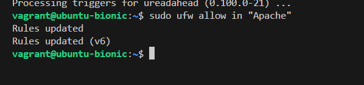
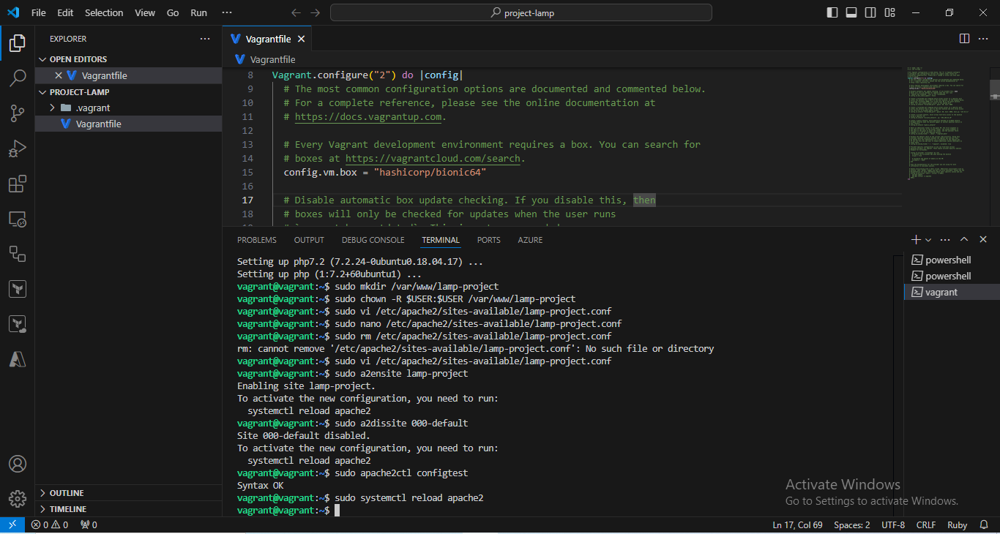
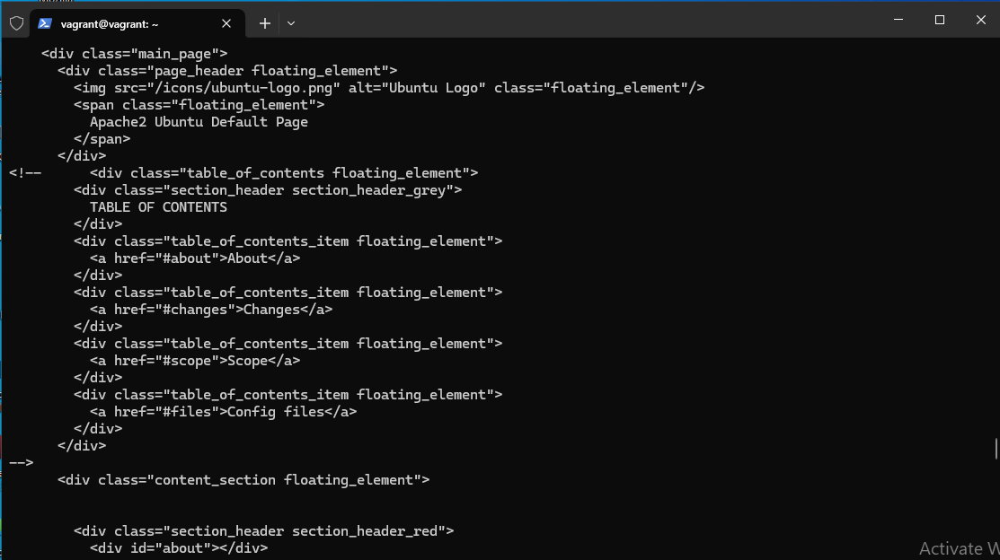
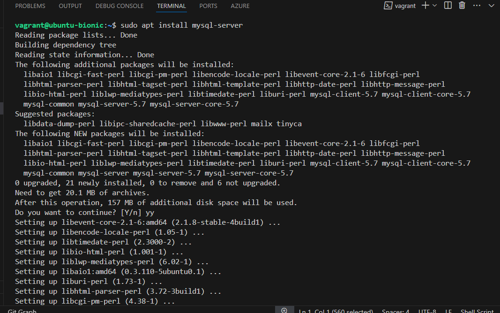
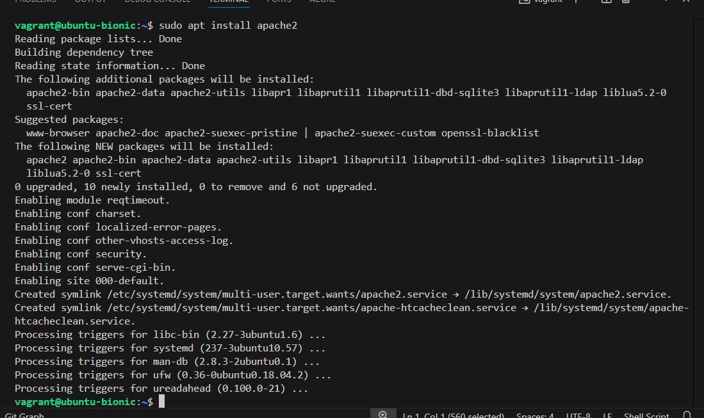
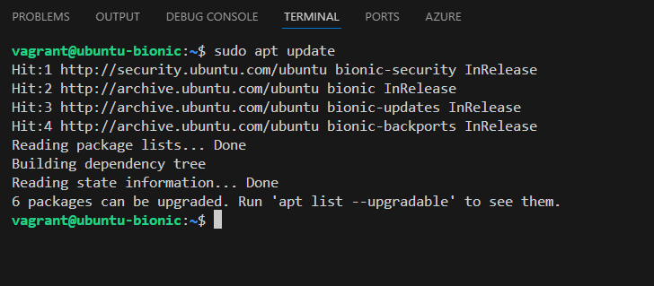

# lemp-project

 ## add images here

 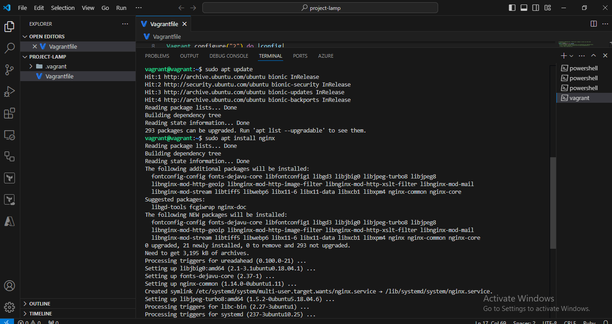
 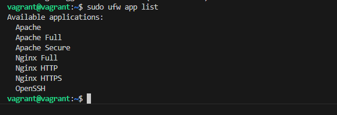
 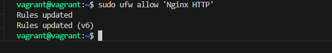
 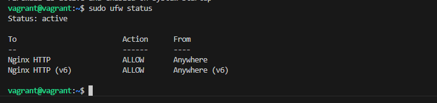
 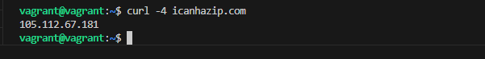
 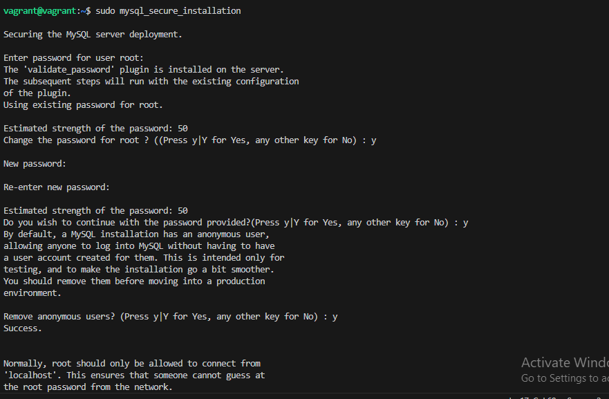

 # Package management

 ## add images here
 
 
 

 # User and group management

 ## add images here
 
 
 
 
 

 # Shell scripting

 # add images here
 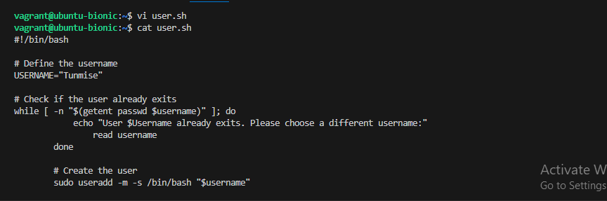
 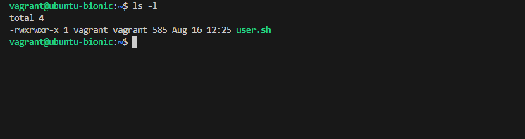
 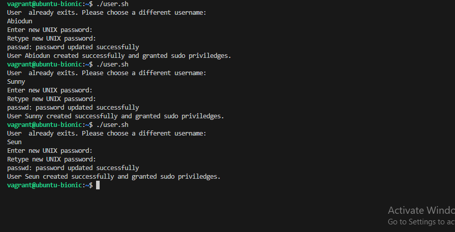
 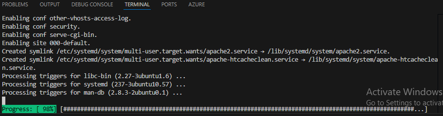
 
 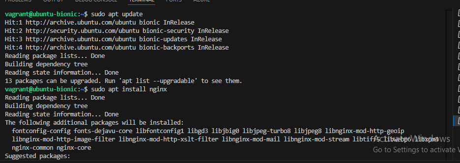
